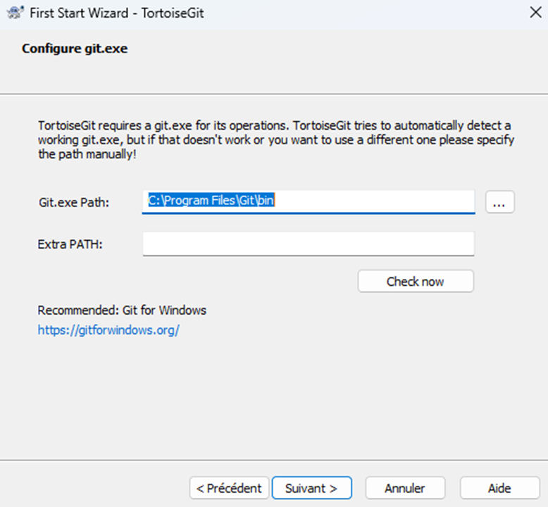
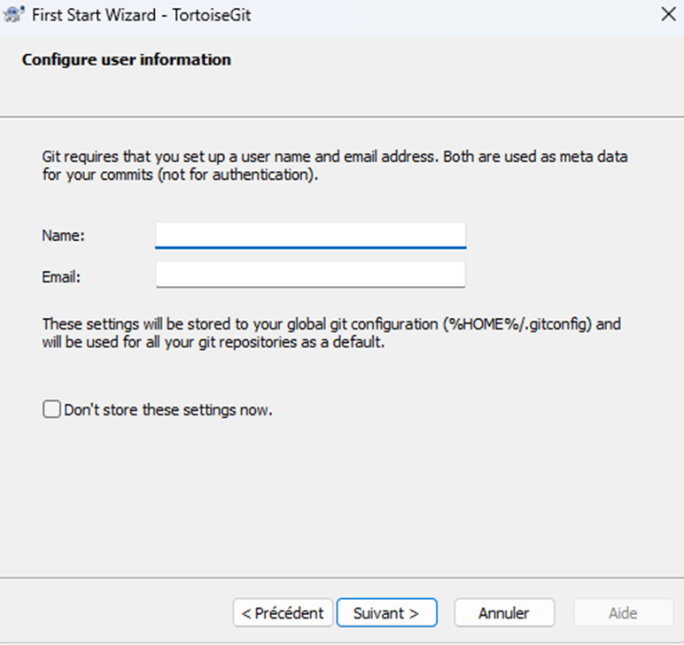
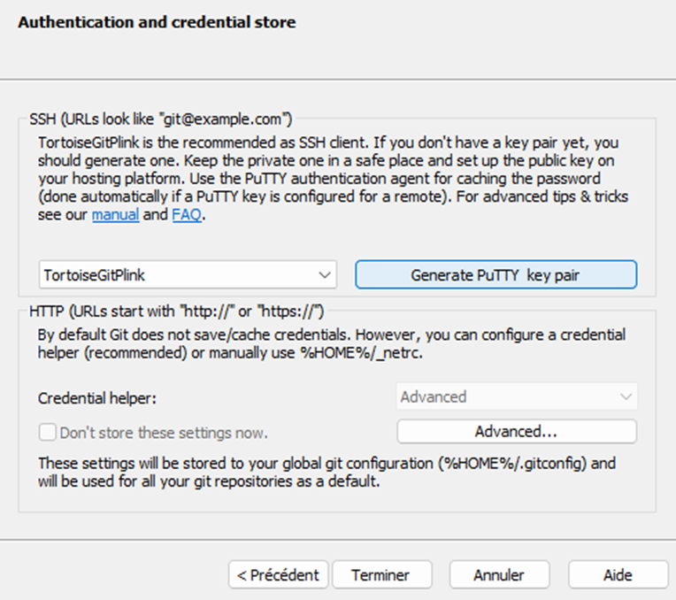
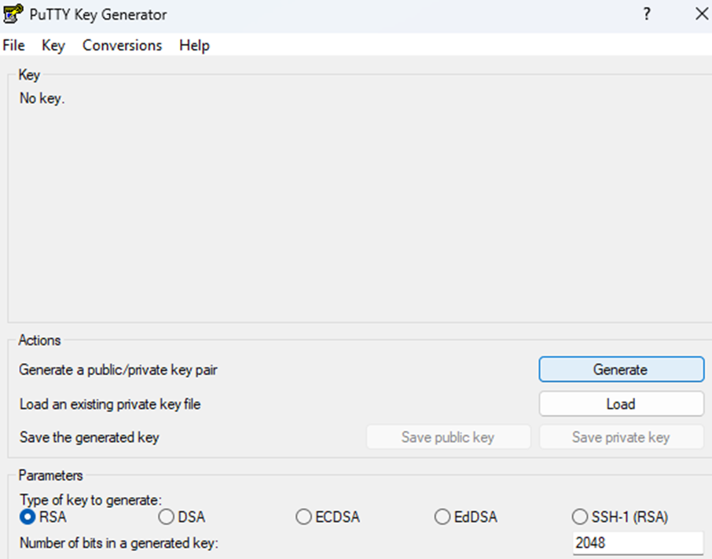
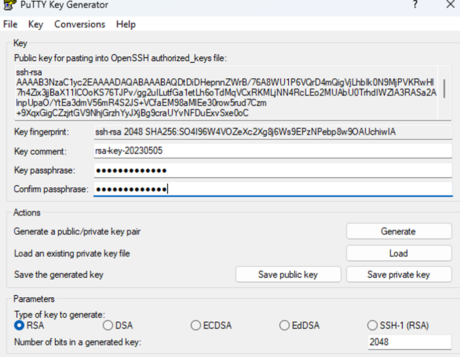

## Installer TortoiseGit

A vous de choisir votre favoris, nous utiliserons, TortoiseGit pour cette introduction à Git. ( les logiciels évoluent avec le temps, il est possible que les étapes soit différentes.)

Devrait être déjà bon par défaut, si vous avez choisi un dossier différent lors de l’installation, définir le bon dossier ici.

Entrer un nom et un email. 

Cliquer « generate » et suivre les instructions ( bouger la souris au dessus le la surface vierge.

Choisir un mot de passe et cliquer save public et private

Une fois GIT et TortoiseGIT installé, redémarré votre ordinateur pour être sûr que les fonctionnalités sont intégrés dans l’explorateur Windows.

